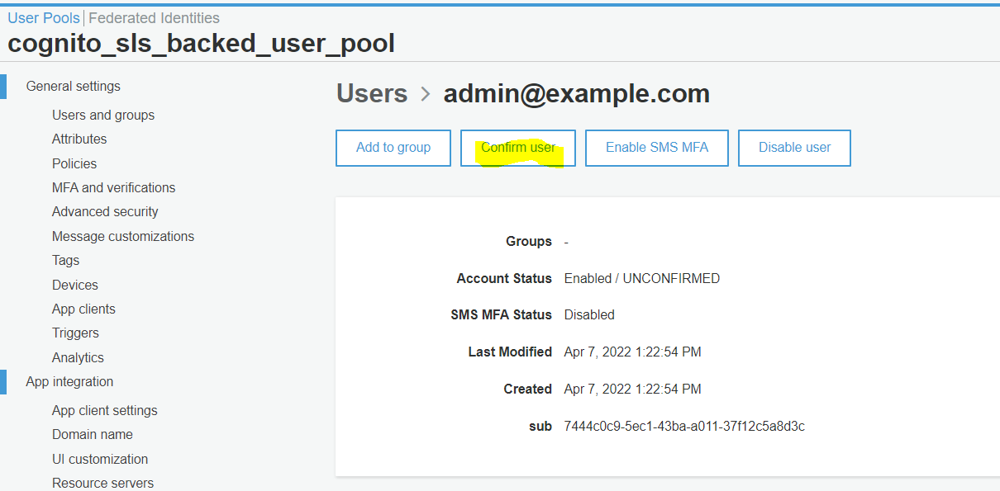

# I concetti

## UserPool
User pools are user directories that provide sign-up and sign-in options for your app users

A user pool is a user directory in Amazon Cognito. Your app users can sign in either directly through a user pool, or federate through a third-party identity provider (IdP). The user pool manages the overhead of handling the tokens that are returned from social sign-in through Facebook, Google, Amazon, and Apple, and from OpenID Connect (OIDC) and SAML IdPs. Whether your users sign in directly or through a third party, all members of the user pool have a directory profile that you can access through an SDK.

## UserPoolClient
After you create a user pool, you can create an app to use the built-in webpages for signing up and signing in your users.

## IdentityPool
Identity pools enable you to grant your users access to other AWS services

With an identity pool, your users can obtain temporary AWS credentials to access AWS services, such as Amazon S3 and DynamoDB. Identity pools support anonymous guest users, as well as federation through third-party IdPs.

Questi hanno tra le proprietà, i `CognitoIdentityProviders` che possono essere tra gli altri un `UserPoolClient`


# Possibili scenari

C'è proprio una pagina AWS [Common Amazon Cognito scenarios](https://docs.aws.amazon.com/cognito/latest/developerguide/cognito-scenarios.html) BELLISSIMA! E' Proprio quella che cercavo

**This topic describes six common scenarios for using Amazon Cognito.** !!!

Da qui capisco anche il discorso del Amazon Cognito authorizer Lambda function, che secondo me è da usare se nella richiesta c'è il token dello user pool, mentre se si passa dall'identity pool, allora in quel caso nella richiesta ci saranno le credenziali AWS quindi bisogna usare AWS authorizer

# Miei progettini esempio

## Foobar 2018

Rifatto progettino secondo questi due video di foobar:
- [Parte backend](https://github.com/mavi888/sls-cognito-backend)
- [Parte frontend](https://www.youtube.com/watch?v=-ZrYlsEBLmo&t=0s)

[Qui](https://github.com/fabiux76/sls-cognito-1) il mio repo

Cosa ricordare di questo:

- L'obiettivo di questo progetto è definire uno UserPool + IdentityPool, più un'endpoint ApiGateway protetto 
- Parte backend sviluppato con serverless
- Le risorsce (cloudformation) definite sono
    - `UserPool`
    - `UserPoolClient`
    - `IdentityPool` (che come `CognitoIdentityProviders` ha il `CognitorUserPool` + `CognitoUserPoolClient`)
    - Ruoli per utenti autenticati e non autenticati + Attach di tali ruoli al `IdentityPool`
- Il ruole per gli utenti loggati indica che possono fare la chiamata all'api:
    ```yaml
    - Effect: "Allow"
      Action:
        - "execute-api:Invoke"
      Resource: "*"
    ```
- Per l'ApiGateway create come evento della lambda vengono specificati questi valori:
    ```yaml
    functions:
        hello:
            handler: handler.hello
            events:
            - http:
                path: hello
                method: get
                cors: true
                authorizer: aws_iam
    ```
    In particolare si specifica che l'`authorzer` deve essere `aws_iam`
- La parte client è fatta in React (quindi è un'app creata con `create-react-app`) e su questa poi è stato installato il pacakge `aws-amplify`
- Per fare andare amplify con la versione del codice illustrata, ho dovuto installare una versione molto vecchia (`0.3.3`) mentre la latest che sarebbe stata installata (`4`)
- Nell'applicazione client viene fatta questa chiamata fondamentale: 
    ```javascript
    Amplify.configure({
        Auth: {
            mandatorySignIn: true,
            region: config.cognito.REGION,
            userPoolId: config.cognito.USER_POOL_ID,
            identityPoolId: config.cognito.IDENTITY_POOL_ID,
            userPoolWebClientId: config.cognito.APP_CLIENT_ID
        },
        API: {
            endpoints: [
                {
                    name: 'testApiCall',
                    endpoint: config.apiGateway.URL,
                    region: config.apiGateway.REGION
                }
            ]
        }
    });
    ```
- Dopo aver configurato questi parametri poi è possibile usare la libreria amplify per fare cose come:
    - ```javascript
      await Auth.signIn(this.state.email, this.state.password); 
      ```
    - ```javascript
      const newUser = await Auth.signUp({
        username: this.state.email,
        password: this.state.password
      });
      ```
    - ```javascript
      await Auth.confirmSignUp(this.state.email, this.state.confirmationCode);
      ```   
    - ```javascript
      API.get('testApiCall', '/hello'); 
      ```

Tutte le chiamate relative ad Auth usano evidentemente la configurazione settata prima.
Per quanto riguarla la chiamata all'API, evidentemente si intende debba essere autenticata con la modalità specificata, in questo caso con il token AWS ottenuto dell'identityPool viene inserito negli header della richiesta

### Cose che non mi sono chiare di questo progetto

- Nella definizione dell'`IdentityPool`, specifichiamo questa proprietà: `AllowUnauthenticatedIdentities: false`, però poi definiamo anche i ruoli per gli utenti non autenticati... Capire bene i collegamenti


# Comandi utili


## Creazioen utente

```
λ aws cognito-idp sign-up --region us-east-1 --client-id 5i9htq9ejfe2d9qkhk2ec9ohkt --username admin@example.com --password Passw0rd!
```

Output:

```
{                                                                                                                                   
    "UserConfirmed": false,                                                                                                          
    "UserSub": "7444c0c9-5ec1-43ba-a011-37f12c5a8d3c"                                                                                
}                                                                                      
```

L'utente va poi confermato da console




# TODO:
- Collegare google\facebook
- Discorse dell'AWS autenticator per api gateway... come si intreccia? 
    Secondo m
