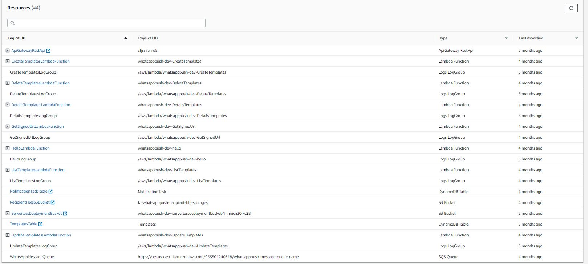

# Repo

https://github.com/fabiux76/WhatsAppPush

# Creazione di progetto serverless

`serverless create --template aws-nodejs --path WhatsAppPush`

In realtà esiste anche il template `aws-nodejs-typescript`. Vedi [capitolo a parte](typescript template.md) per approfondimento su questo. 
L'approccio che ho preso in questo caso è di trasformarlo da javascript

# Gestione dei parametri di configurazione e delle variabili d'ambiente

Environment variable defined under the provider block is accessible in all lambda functions defined for WhatsAppPush. 

# Check su tipi anche senza typescript

Sembra si possa fare (su Visual studio code?= mettendo questo commento nel file
`// @ts-check`
cfr. [here](https://github.com/fabiux76/WhatsAppPush/commit/bf6a1ecb0c69c4c0bb36a516ab9a6642d55d1360)

# Transition to typescript

[Questo](https://github.com/fabiux76/WhatsAppPush/commit/26555586f64cc0223c5182235d1bc75fdc628eda) è il commit che fa la transazione su typescript

Passi:
- Ho creato un `tsconfig.json`
- Ho sostituito la dependency `aws-sdk` con `@types/aws-lambda`
- Ho aggiuto queste devDependencies:
    ```json
      "devDependencies": {
        "@types/hapi__joi": "^17.1.7",
        "@types/node": "^13.13.5",
        "@types/uuid": "^8.3.1",
        "aws-sdk": "^2.1013.0"
    }
    ```
- Nel `serverless.yml` riferosco la funzione nella cartella `build`
- I file da `.js` diventano `.ts` ed annoto parametri, variabili

Ma il build come lo faccio?

# Validazione della richiesta

La validazione del body la facciamo con `joi`

```typescript
const schema = Joi.object({
    template_name: Joi.string().required(),
    template_message: Joi.string().required()
});

const { error, value } = schema.validate(requestBody);
if (error) {
    return handleError(HttpStatus.BAD_REQUEST, 
                        `[Template:Create:Error]:${HttpStatus[HttpStatus.BAD_REQUEST]}:${error}`);
}
```

# Comandi serverless

I comandi possono prendere come opzioni:
- `--stage` or `-s` The stage in your service you want to display information about.
- `--region` or `-r` The region in your stage that you want to display information

## Deploy
`serverless deploy`

## Verifica dello stato del servizio
`serverless info --verbose`

PErò anche nella modalità verbose non si vedono tutte le risorse che invee si vedono sulla console

```
λ serverless info --verbose
Service Information
service: whatsapppush
stage: dev
region: us-east-1
stack: whatsapppush-dev
resources: 44
api keys:
  None
endpoints:
  POST - https://cfjss7amu8.execute-api.us-east-1.amazonaws.com/dev/templates
  PUT - https://cfjss7amu8.execute-api.us-east-1.amazonaws.com/dev/templates/{user_id}/{template_id}
  DELETE - https://cfjss7amu8.execute-api.us-east-1.amazonaws.com/dev/templates/{user_id}/{template_id}
  GET - https://cfjss7amu8.execute-api.us-east-1.amazonaws.com/dev/templates/{user_id}/{template_id}
  GET - https://cfjss7amu8.execute-api.us-east-1.amazonaws.com/dev/templates/{user_id}
  POST - https://cfjss7amu8.execute-api.us-east-1.amazonaws.com/dev/upload-url/{user_id}
  POST - https://cfjss7amu8.execute-api.us-east-1.amazonaws.com/dev/notification
functions:
  CreateTemplates: whatsapppush-dev-CreateTemplates
  UpdateTemplates: whatsapppush-dev-UpdateTemplates
  DeleteTemplates: whatsapppush-dev-DeleteTemplates
  DetailsTemplates: whatsapppush-dev-DetailsTemplates
  ListTemplates: whatsapppush-dev-ListTemplates
  GetSignedUrl: whatsapppush-dev-GetSignedUrl
  CreateNotification: whatsapppush-dev-CreateNotification
  hello: whatsapppush-dev-hello
layers:
  None

Stack Outputs
WhatsAppMessageQueueURL: https://sqs.us-east-1.amazonaws.com/955501240318/whatsapppush-message-queue-name
ServiceEndpoint: https://cfjss7amu8.execute-api.us-east-1.amazonaws.com/dev
ServerlessDeploymentBucketName: whatsapppush-dev-serverlessdeploymentbucket-1hmecn30ikc28
```

Da console vedo questo:


## Cancellazione
`serverless remove` 

## Test locale

### Invocazione diretta delle funzioni

Es:

`serverless invoke local --function CreateNotification --path test\CreateNotificationPayloadSingle.json`

# Compilazione

Per trasformare da javascript a typescript, vado nella root del progetto (dove c'è il `tsconfig.json`e faccio semplicemente:
`tsc`

Per capire meglio come gestire typescript con vscode è sicuramente utile leggersi questo [tutorial](https://code.visualstudio.com/docs/typescript/typescript-tutorial)

# Debug

Info qui:
- [VSCode doc](https://code.visualstudio.com/docs/editor/debugging)

Step 1: Sono riuscito a fare un primo passo. Debuggare sul codice javascript (non typescript). Per fare questo è dovuto installare localmente al progetto serverless (non global) ed ho anche dovuto aggiornare la versione a 3 del serverless.yaml
Poi usato creaa la launch configuration puntando `program` a `${workspaceRoot}/node_modules/serverless/bin/serverless.js`
Non ho ancora capito però dove va a mettere l'outpur (immagino che se chiamo serverless da cli mi stampa la risposta di default mentre così no)

MA bisogna ancora fare tanto:
- Dove trovo gli output?
- C'è però il problema di come debuggate typescript!!!!! 
- L'ideale sarebbe poter dire a serverless di usare direttamente typescript! Forse in questo caso si riesce a debuggare bene
- Poi sarebbe interessante investigare anche come usare questo plugin: [serverless offline](https://www.serverless.com/plugins/serverless-offline)

# Client

Per testare il caricamento di file da client web mi ero fatto un [progetto parallelo con react](https://github.com/fabiux76/whats-app-push-client)

La faccio partire con `npm start` e funziona ancora :)


# Collezione Postman per le prove

...

# Dubbi

- Com'è che facevo la build??? ts-node? poi serverless...
- Non ho capito l'uso dell'idempotentkey. Sostanzialmente è una chiave usata epr evitare inserimenti duplici... Non si poteva usare un id di dynamo?
- ci sono diversi `as any` nella chiamata a dynamodb che non mi piacciono. Sicuramente si può fare qualcosa...VERIFICARE
- Anche questo `process.env.DDB_TEMPLATES_TABLE_NAME || ""` va sistemato
- Sistemare anche `getSignedUrlPromise` parametro not typed
- Avevo fatto anche dei file di test .json. Come la facevo l'invocazione? con qualcosa tipo `serverless invoke local --function functionName --path lib/data.json`


